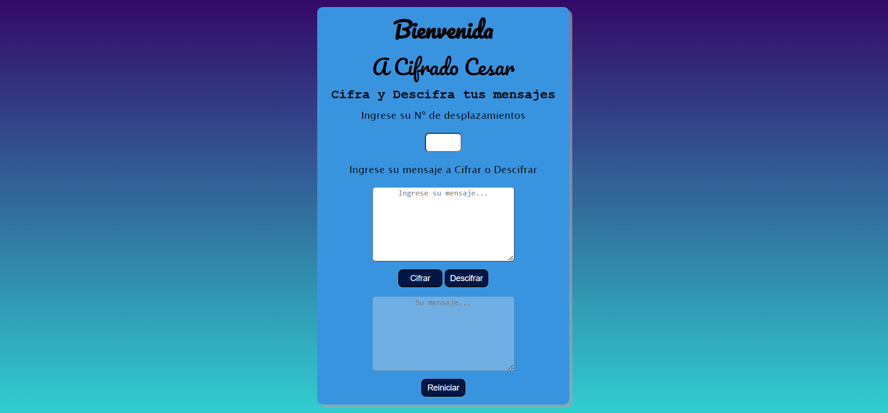

# Cifrado César

# Índice

- [1. Resumen del proyecto](#1-resumen-del-proyecto)
- [2. Tecnologias usadas](#2-tecnologias-usadas)
- [3. Vistas](#4-vistas)
- [4. Instrucciones](#5-instrucciones)
- [5. Enlace Deploy](#6-enlace-deploy)

---

## 1. Resumen del proyecto

Esta página web, te permite codificar tus mensajes en base al cifrado César. Pero, ¿qué es el cifrado César?. El cifrado César es un tipo de cifrado por sustitución en el que una letra en el texto original es reemplazada por otra letra que se encuentra un número fijo de posiciones más adelante en el alfabeto. Por ejemplo, con un desplazamiento de 3, la A sería sustituida por la D (situada 3 lugares a la derecha de la A), la B sería reemplazada por la E, etc. Este método debe su nombre a Julio César, que lo usaba para comunicarse con sus generales.

## 2. Tecnologias usadas

- HTML5
- CSS
- Javascript ES6

## 3. Vistas

-Version desktop

## 4. Instrucciones

Para Cifrar:

- Elegir un offset de desplazamiento.
- Ingresar texto a cifrar.
- Oprime boton "cifrar tu mensaje".
- Recibe tu mensaje cifrado.
- Oprime boton "reiniciar" para limpiar y volver a utilizar.

Para descifrar:

- Elegir un offset de desplazamiento.
- Ingresar texto a descifrar.
- Oprime boton "descifrar tu mensaje".
- Recibe tu mensaje descifrado.
- Oprime boton "reiniciar" para limpiar y volver a utilizar.

## 5. Enlace Deploy

https://jhoanazf.github.io/DEV005-cipher/
